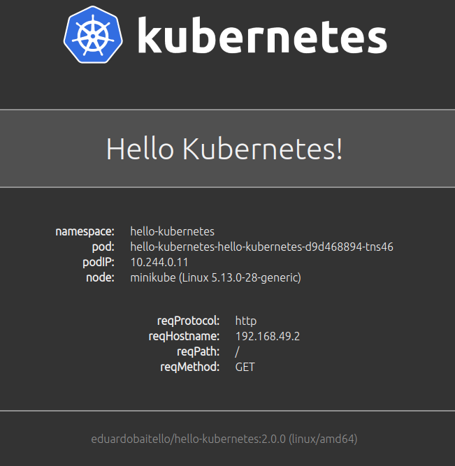

# Hello Kubernetes!

[](https://hub.docker.com/repository/docker/paulbouwer/hello-kubernetes) [](https://hub.docker.com/repository/docker/paulbouwer/hello-kubernetes) [](https://hub.docker.com/repository/docker/paulbouwer/hello-kubernetes)

This container image can be deployed on a Kubernetes cluster. It runs a static web site, that displays the following:

- a default **Hello world!** message
- the pod name
- node os information



## Deploy

You can deploy `hello-kubernetes` to your Kubernetes cluster using [Helm 3](https://helm.sh/docs/intro/install/). You can find all the `hello-kubernetes` Helm chart installation and configuration options in the [Deploy using Helm](docs/deploy-using-helm.md) guide.

```bash
cd deploy/helm
```

### Example 1: Default

Deploy into `hello-kubernetes-default` namespace with default "Hello world!" message. The `hello-kubernetes` app is exposed via a public Load Balancer on port 80 by default - note that this only works in cloud provider based Kubernetes offerings.

```bash
helm install --create-namespace --namespace hello-kubernetes-default hello-world ./hello-kubernetes

# get the LoadBalancer ip address.
kubectl get svc hello-kubernetes -n hello-kubernetes-default -o 'jsonpath={ .status.loadBalancer.ingress[0].ip }'
```

### Example 2: Custom message

Deploy into `hello-kubernetes-custom` namespace with "I just deployed this on Kubernetes!" message. The `hello-kubernetes` app is exposed via a public Load Balancer on port 80 by default - note that this only works in cloud provider based Kubernetes offerings.

```bash
helm install --create-namespace --namespace hello-kubernetes-custom hello-custom ./hello-kubernetes \
  --set message="I just deployed this on Kubernetes!"

# get the LoadBalancer ip address.
kubectl get svc hello-kubernetes -n hello-kubernetes-custom -o 'jsonpath={ .status.loadBalancer.ingress[0].ip }'
```

### Example 3: Ingress

Deploy into `hello-kubernetes-ingress` namespace. This example assumes that an ingress has been deployed into the cluster and that the ingress has a path of `/app/hello-kubernetes/` mapped to the `hello-kubernetes` service.

The `hello-kubernetes` app can be reached on the ip address of the ingress at the `/app/hello-kubernetes/` path.

```bash
helm install --create-namespace --namespace hello-kubernetes-ingress hello-ingress ./hello-kubernetes \
  --set ingress.enabled=true \
  --set ingress.pathPrefix="/app/hello-kubernetes/" \
  --set service.type="ClusterIP"
```

## Build Container Image

If you'd like to build the image yourself, then you can do so as follows. The `build-arg` parameters provides metadata as defined in [OCI image spec annotations](https://github.com/opencontainers/image-spec/blob/master/annotations.md).

Bash
```bash
$ docker build --no-cache --build-arg IMAGE_VERSION="1.9" --build-arg IMAGE_CREATE_DATE="`date -u +"%Y-%m-%dT%H:%M:%SZ"`" --build-arg IMAGE_SOURCE_REVISION="`git rev-parse HEAD`" -f Dockerfile -t "hello-kubernetes:1.9" app
```

Powershell
```powershell
PS> docker build --no-cache --build-arg IMAGE_VERSION="1.9" --build-arg IMAGE_CREATE_DATE="$(Get-Date((Get-Date).ToUniversalTime()) -UFormat '%Y-%m-%dT%H:%M:%SZ')" --build-arg IMAGE_SOURCE_REVISION="$(git rev-parse HEAD)" -f Dockerfile -t "hello-kubernetes:1.9" app
```

## Develop Application

If you have [VS Code](https://code.visualstudio.com/) and the [Visual Studio Code Remote - Containers](https://marketplace.visualstudio.com/items?itemName=ms-vscode-remote.remote-containers) extension installed, the `.devcontainer` folder will be used to build a container based node.js 13 development environment. 

Port `8080` has been configured to be forwarded to your host. If you run `npm start` in the `app` folder in the VS Code Remote Containers terminal, you will be able to access the website on `http://localhost:8080`. You can change the port in the `.devcontainer\devcontainer.json` file under the `appPort` key.

See [here](https://code.visualstudio.com/docs/remote/containers) for more details on working with this setup.